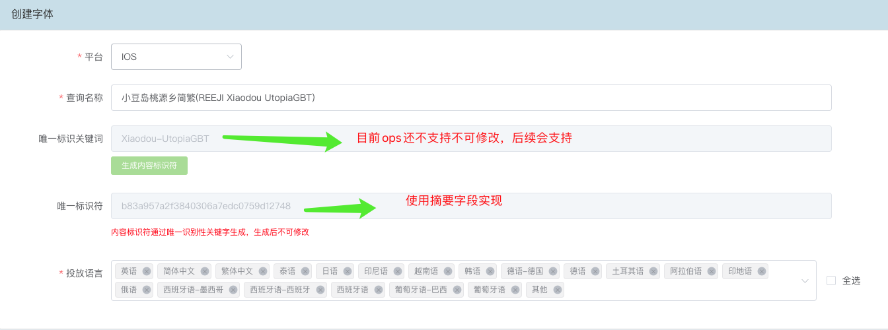
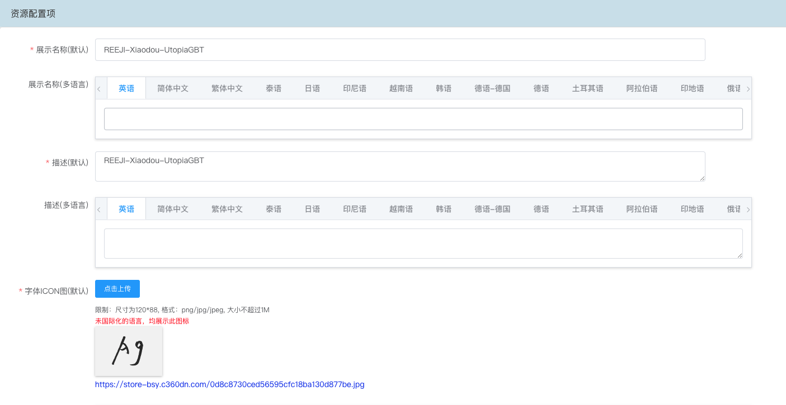
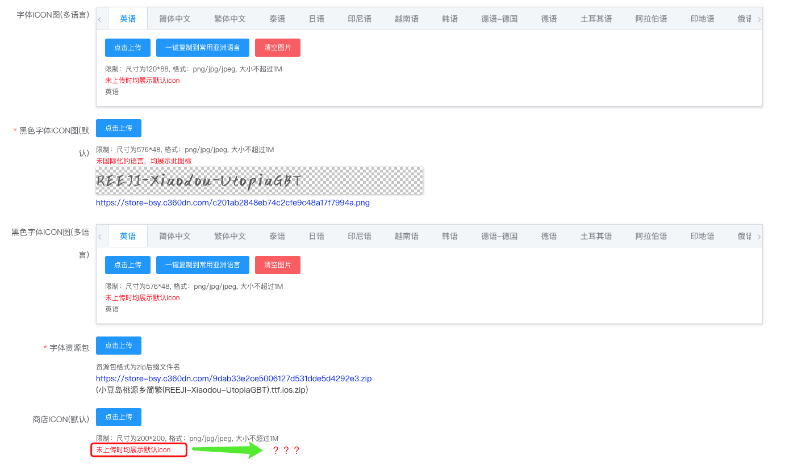
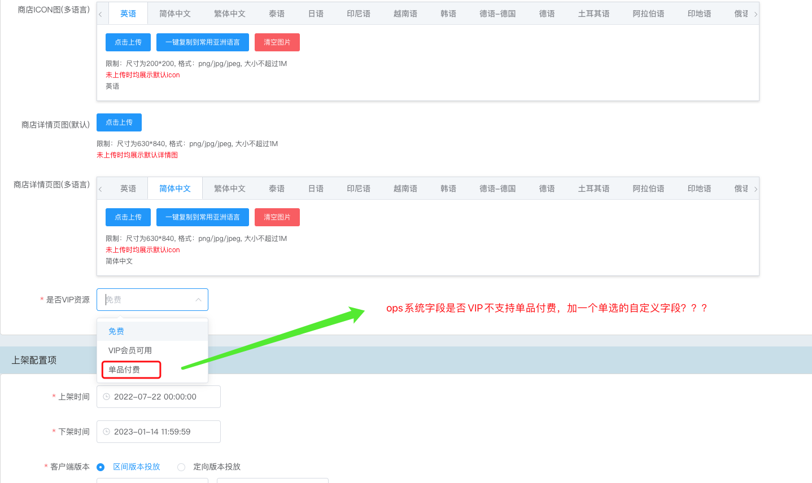
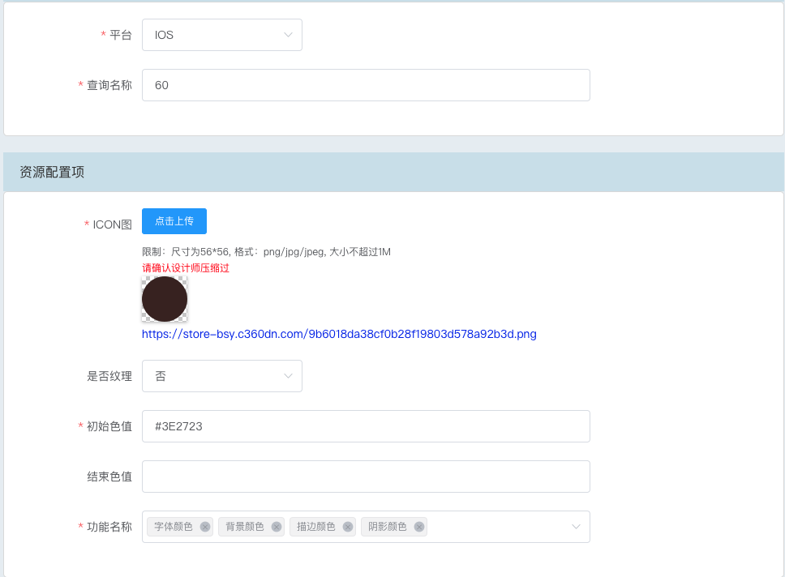

# 字体迁移整理
###  迁移整理
**需要迁移的数据：**
   1. 迁移字体
   2. 迁移颜色

**迁移方案：**
   将在ops创建字体(unityFont)和颜色(unityColor)两个素材字段表，用于保存需要迁移的数据，同时创建无分类的字体素材位（unityFontPosition）和颜色素材位（unityColorPosition）用于投放数据，并在兼容接口拉取两个位置下的素材进行组装下发；
   
   目前在comfort后台字体和颜色只存在ios平台的数据不用考虑是否需要合并；
#### 字段整体
##### 字体字段整理
1. 迁移字体字段说明如下图所示(无标注表示可正常操作无需特别说明)：




*单品付费选中时展示的样式：*

单品付费选中处理方式：
    1. **目前字体没有使用单品付费的配置，且没有下发相关商店ID配置**，是否可以不迁移单品付费的选项，这样可以直接使用ops 系统字段是否vip的字段；（对后续支持配置单品付费不友好）
    2. 加一个单品付费的自定义字段做兼容，是否vip 还是使用是否vip字段，在兼容接口处理；

2. bmall 与 ops 字段对照表：
    | bamall字段名 | bmall字段code |  ops 字段名  | ops字段code | 说明 | 是否必填 |
    | --- | --- | --- | --- | --- | --- |
    | 查询名称  |   name | 素材名称  |   name |  --  |  是  |
    |  平台 + 客户端版本  |  platform |  试用平台 |  platform |  会合并适用平台和客户端版本 |  是 |
    |  唯一标识关键词 | content_identify_keyword |  唯一标识关键词 | content_identify_keyword |  ops后续会只支持填写一次 |  否 |
    | 唯一标识符  | content_identify_key  |  摘要  |  summary |  ops在字段配置中会关联`唯一标识关键词`字段 | 否  |
    | 展示名称（默认+多语言） | display_name | 展示名称 | display_name | 使用ops 本地化字段做兼容 | 是 |
    | 描述（默认+多语言） | description | 描述 | description | 使用ops 本地化字段做兼容 | 是 |
    | 字体icon图（默认+多语言） | icon | 字体icon图 | icon | 同上 | 是 |
    | 黑色字体icon图（默认+多语言） | black_icon | 黑色字体icon图 | black_icon | 同上 | 是 |
    | 商店ICON（默认+多语言） | store_icon | 商店ICON | storeIcon | 同上（不兼容） | 否 |
    | 商店详情ICON（默认+多语言） | store_detail_icon | 商店详情ICON | storeDetailIcon | 同上（不兼容） | 否 |
    | 字体资源包 | zip相关 | 字体资源包 | resource | --- | 是 |
    | 是否vip资源 | vip | 是否vip | vip | ops 不支持单品付费 | 是 |
    | --- | --- | 是否单品付费 | payPerItem | 兼容迁移的字段（不兼容，字体涉及版权问题现在老后台都没有设置，运营同学表示目前也没有支持的必要） | 否 |
    | 商店ID | market_product_id | 商店ID | marketProductID | 商店id（不兼容） | 否 |
    | 商店价格 | market_product_price | 商店价格 | marketProductPrice | 商店价格（不兼容） | 否 |
    | 上+下架时间 | onsale_time + off_time | 有效期 | validDuration | --- | 是 |

##### 颜色字段整理
1. 需迁移字段如图所示：


2. bmall 与 ops 字段对照表：
    | bamall字段名 | bmall字段code |  ops 字段名  | ops字段code | 说明 | 是否必填 |
    | --- | --- | --- | --- | --- | --- |
    | 查询名称  |   name | 素材名称  |   name |  --  |  是  |
    |  平台   |  platform |  试用平台 |  platform |  -- |  是 |
    | --      | ----  | 是否VIP | isVip | ops 系统字段 设置为否 | 是 |
    | -- | -- | 有效期 | validDuration | ops 素材系统字段 设置为永久 | 是 | 
    | ICON图 | icon | icon图 | icon | -- | 是 |
    | 是否纹理 | is_texture | 是否纹理 | isTexture | ops 单选组件 否 ：0 是：1 |  |
    | 纹理图片 | texture_pic | 纹理图片 | texturePic | 是否纹理为是时需上传的纹理图片字段 | 否 |
    | 初始色值 | start_hex | 初始色值 | startHex | 是否纹理为否时需设置的初始颜色值 | 否 |
    | 结束色值 | end_hex | 结束色值 | endHex | 是否纹理为否时需设置的结束颜色值 | 否 |
    | 功能名称 | feature_tags | 功能名称 | featureTags | ops多选字段 选项值：字体颜色(font), 背景颜色(background), 描边颜色(sketch), 阴影颜色(shadow) | 是 |

#### 需兼容的接口
1. **字体下发接口**
   **path:** /api/product/unity-font
   **response:**
      ```json
      {
        "data": {
          "packages": [
            {
                "pid": "62dfdc3f8a1744370fc62a4d",
                "name": "REEJI-Xiaodou-UtopiaGBT",
                "icon": "https://store-bsy.c360dn.com/0d8c8730ced56595cfc18ba130d877be.jpg",
                "black_icon": "https://store-bsy.c360dn.com/c201ab2848eb74c2cfe9c48a17f7994a.png",
                "onsale_time": 1658419200,
                "off_time": 1673668799,
                "vip": 0,
                "display_md5": "6ef120953981e2fb274b1543b4ddb098",
                "content_identify_key": "b83a957a2f3840306a7edc0759d12748",
                "content_identify_keyword": "fontXiaodou-UtopiaGBT",
                "tagContent": 0,
                "tagOnTime": 0,
                "tagOffTime": 0,
                "description": "REEJI-Xiaodou-UtopiaGBT",
                "down_url": "https://store-bsy.c360dn.com/62e3b6ab3c6f1_62dfdc3f8a1744370fc62a4d.zip",
                "market_product_id": "",
                "market_product_price": "¥0.00"
            }
          ],
          "colors": [
            {
                "name": "01",
                "icon": "https://store-bsy.c360dn.com/88a519aeabaeb3b0e1a2bead8962c1ec.png",
                "start_hex": "#FFFFFF",
                "end_hex": "",
                "is_texture": 0,
                "texture_pic": "",
                "cid": "60e5585d2980633304188d28"
            },
        
          ],
          "features": [
            {
                "tag": "font",
                "color_ids": [
                    "60e5585d2980633304188d28"
                ]
            },
            {
                "tag": "background",
                "color_ids": [
                    "60e5585d2980633304188d28"
                ]
            },
            {
                "tag": "sketch",
                "color_ids": [
                    "60e5585d2980633304188d28"
                ]
            },
            {
                "tag": "shadow",
                "color_ids": [
                    "60e5585d2980633304188d28"
                ]
            },
          ],
         "locale": "ja",
         "interval": 43200
        },
        "status": 200,
        "message": "ok",
        "serverTime": 1687330834.3802
      }
      ```
2. **字体详情接口**
   **path:** /api/product/detail
   **response:**
   ```json
    {
    "data": [
        {
            "pid": "63856cf3217f277a0d8b4573",
            "descript": "江西拙楷ios",
            "name": "江西拙楷ios",
            "icon": "https://store-bsy.c360dn.com/q_d2a1524699e30f8dd31e29a15d956f97.png",
            "origin_pic": "",
            "effect_pic_info": [
                {
                    "name": "江西拙楷ios",
                    "item_id": "63856cf3217f277a0d8b4572",
                    "pic": "https://store-bsy.c360dn.com/q_d2a1524699e30f8dd31e29a15d956f97.png"
                }
            ],
            "package_zip": "https://store-bsy.c360dn.com/63856d07731e1_63856cf3217f277a0d8b4573.zip",
            "package_zip_md5": "5157c7f357df947b9e7cdd025505c13b",
            "display_zip_url": "https://store-bsy.c360dn.com/63856d093000f_display_63856cf3217f277a0d8b4573.zip",
            "display_zip_md5": "f724e1fe1c9915e200c16968f5ce8ccd",
            "file_size": 4858628,
            "items": [
                {
                    "id": "63856cf3217f277a0d8b4572",
                    "sub_type": "font",
                    "zip_url": "https://store-bsy.c360dn.com/q_4431183a95280309631895afc960a75e.zip",
                    "zip_md5": "q_4431183a95280309631895afc960a75e",
                    "display_zip_url": "https://store-bsy.c360dn.com/f0e376a0164443c16216ab48cd78883c.zip",
                    "display_zip_md5": "f0e376a0164443c16216ab48cd78883c"
                }
            ],
            "type": 60,
            "onsale_time": 1623911405,
            "off_time": 1688054400,
            "unlock_type": 0,
            "typeCountInfo": {
                "font": 1
            },
            "vip": 2,
            "vip_banner": "",
            "icon_ab": {
                "tid": "filter_panel_source_list",
                "gid": "filter_panel_default_source_list"
            }
        }
    ],
    "status": 200,
    "message": "ok",
    "serverTime": 1687331689.9413
    }
   ```