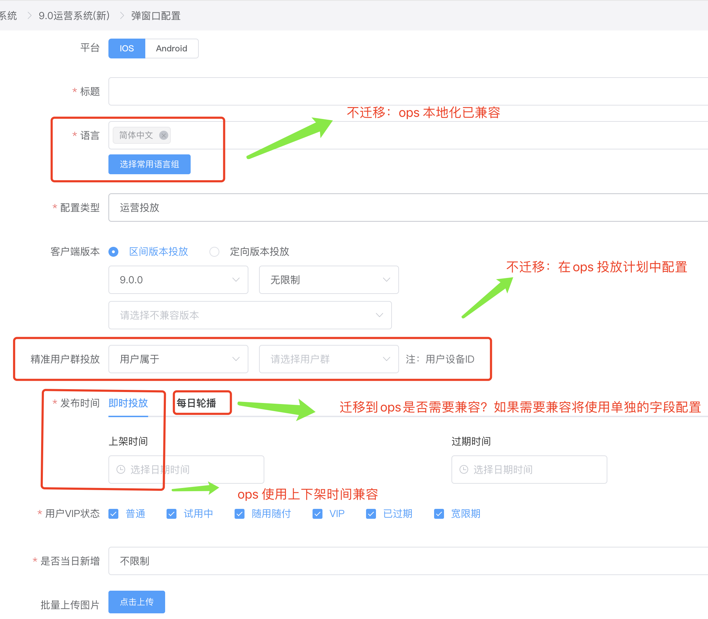

### 首页弹窗迁移整理
[comfort 首页弹窗配置地址](https://comfort.camera360.com/camera360/dispatcher/v9Manager/popWindow)
[comfort 首页弹窗数据列表](https://comfort.camera360.com/camera360/dispatcher/history/ad90)
#### 迁移整理
- 是否只迁移如下图所示筛选条件的返回的数据？
  
   *ps： 图示筛选条件在后台代码有隐含筛选条件：`过期时间大于等于当前时间`, 界面只展示了8条数据库已发布状态的数据有4千条*
   - 如果只有8条数据需要迁移，是否可接受手动迁移？
- 下图所示，未理解且待确认？
   
   *ps: 首页和相机是指什么？在后台对应数据展示位置在哪？合并计次是什么逻辑？*
- 迁移字段说明(如下图所示)： 
    
    
    

#### 迁移字段对照表(待续...)
 | bamall字段名 | ops 字段名 | bmall字段code | ops字段code | 说明 | 是否必填 |
 | --- | --- | --- | --- | --- | --- |
#### 兼容接口说明（待续...）

#### 补充说明
e.g： 会议记录

